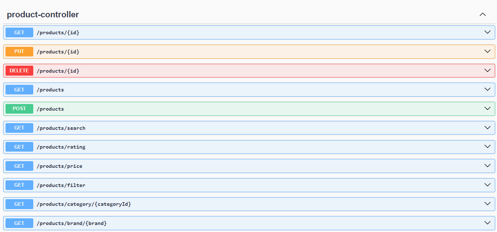
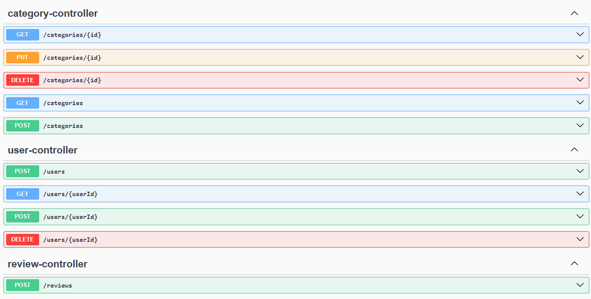
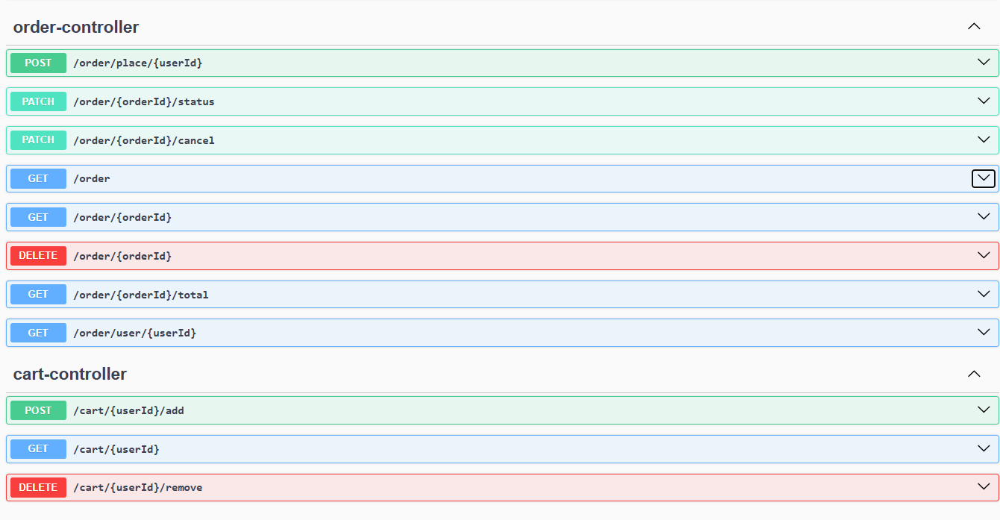

# E-Commerce-App
This project is a complete E-Commerce Backend REST API built using Spring Boot, designed to manage users, products, categories, brands, reviews, carts, and orders.

## Screenshots

### Product

### Category

### Order & Cart

